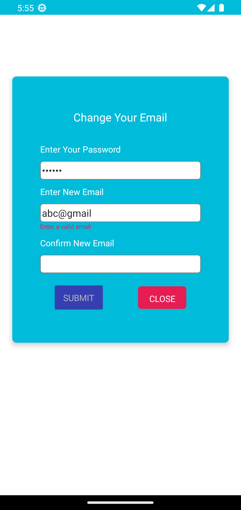
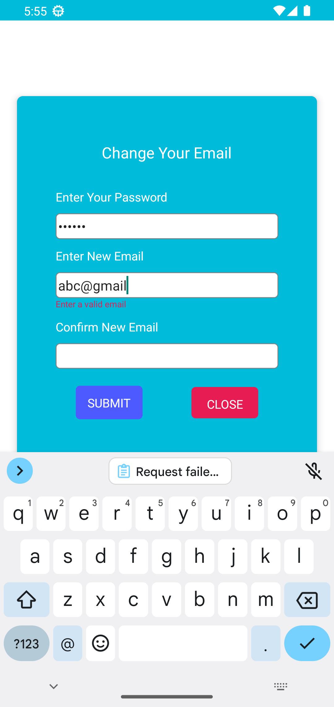

# react-native-email-validator 👈👈👈

Validate your email address simply

|  |  |
| ---------------------------------- | ---------------------------------- |

## Installation

Using Yarn:

```sh

yarn add react-native-email-validator

```

Using NPM:

```sh

npm install react-native-email-validator

```

## Import

```js
import validate from 'react-native-email-validator';
```

## Check

```js
validate('alauddin12340@gmail.com'); // true
validate('abc.com'); // false
```

## Result

```js
{
  validate('abc@gmail.com')
    ? console.log('Email is valid')
    : console.log('Email is not valid');
}
```

## Contributing

See the [contributing guide](CONTRIBUTING.md) to learn how to contribute to the repository and the development workflow.

## License

MIT

---

Made with [create-react-native-library](https://github.com/callstack/react-native-builder-bob)
